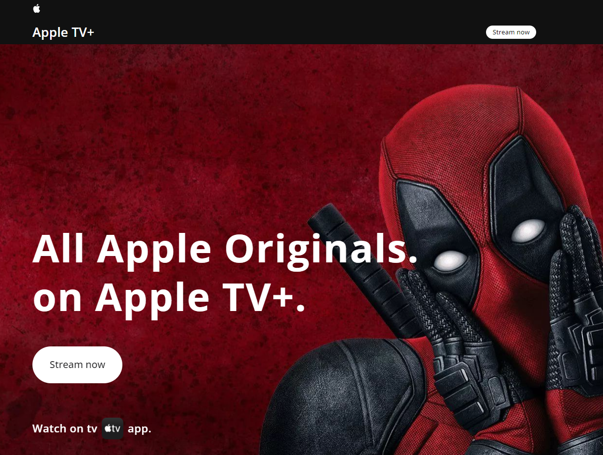

# Apple TV+ - Landing Page



Uma aplicação construída com foco nas animações presentes na página inicial da Apple TV+.

## Tecnologias
- React.js
- React-use
- Typescript
- TailwindCSS
- Tailwind Merge
- Tailwind Variants
- Framer Motion
- Lucide-react
- vite

## Executando

Após clonar o repositório, acesse a pasta do projeto e execute os comandos abaixo:
```bash
pnpm install
pnpm dev
```